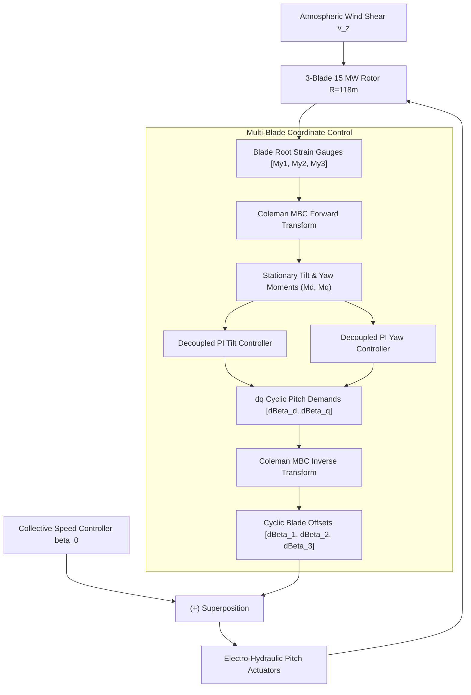

# Wind Turbine Individual Pitch Control (IPC) & Load Alleviation Digital Twin

An interactive 3D physics simulation and control systems digital twin modeling asymmetric aerodynamic load mitigation in 15 MW offshore wind turbines (such as the Vestas V236-15.0 MW platform).

🔗 **Live In-Browser Simulator:** [https://elomarjc.github.io/turbine-load-control-twin/](https://elomarjc.github.io/turbine-load-control-twin/)

---

## 1. Engineering Motivation & System Overview

As offshore wind turbine rotor diameters exceed $230\text{ meters}$, atmospheric boundary layer wind shear and wake turbulence create severe periodic $1P$ ($0.13\text{ Hz}$) and $3P$ aerodynamic load differentials across the rotor plane. The wind speed at the top of the blade sweep ($z = 268\text{ m}$) can be $30\text{--}40\%$ higher than at the bottom ($z = 32\text{ m}$).

Conventional **Collective Pitch Control (CPC)** regulates generator speed by pitching all three blades identically, but fails to alleviate asymmetric tilt and yaw moments that drive structural fatigue in the blade roots, pitch bearings, and main frame.

**Individual Pitch Control (IPC)** uses the **Coleman Multi-Blade Coordinate (MBC)** transformation to decouple rotating blade root bending moments into non-rotating coordinates, applying cyclic pitch perturbations ($\pm 3\text{--}5^\circ$) to neutralize asymmetric loads before they transmit to the tower.



---

## 2. Mathematical Modeling & Control Dynamics

### 2.1 Atmospheric Wind Shear Profile

Vertical wind velocity variation is modeled using the power-law profile:

$$v(z) = v_{\text{hub}} \left( \frac{z}{H_{\text{hub}}} \right)^\alpha$$

where:
* $v_{\text{hub}}$ is the mean wind speed at hub height ($H_{\text{hub}} = 150\text{ m}$).
* $\alpha \approx 0.14\text{--}0.25$ is the offshore wind shear exponent.

The elevation of each blade center-of-thrust varies with azimuth angle $\psi_i(t)$:

$$z_i(t) = H_{\text{hub}} + r_{\text{eff}} \cos(\psi_i(t))$$

where $r_{\text{eff}} \approx 0.66 R = 78\text{ m}$ is the effective radial aerodynamic center.

---

### 2.2 Aerodynamic Flapwise Bending Moments

Relative inflow velocity at blade section is:

$$v_{\text{rel}, i} = \sqrt{v_i^2 + (\Omega r_{\text{eff}})^2}$$

The aerodynamic flapwise out-of-plane thrust force generates root bending moments:

$$M_{yi}(t) = \frac{1}{2} \rho A_{\text{blade}} C_L(\alpha_i) v_{\text{rel}, i}^2 r_{\text{eff}}$$

Because $v_i$ varies sinusoidally with rotor rotation, $M_{yi}$ exhibits pronounced $1P$ periodic oscillations.

---

### 2.3 Coleman Multi-Blade Coordinate (MBC) Transformation

The forward Coleman transform projects the 3 rotating blade moments $[M_{y1}, M_{y2}, M_{y3}]$ into stationary non-rotating tilt ($M_d$) and yaw ($M_q$) coordinate frames:

$$M_d = \frac{2}{3} \sum_{i=1}^{3} M_{yi} \cos(\psi_i)$$

$$M_q = \frac{2}{3} \sum_{i=1}^{3} M_{yi} \sin(\psi_i)$$

$$M_0 = \frac{1}{3} \sum_{i=1}^{3} M_{yi}$$

In the $dq$-frame, the $1P$ frequency component is modulated down to $0\text{ Hz}$ (DC bias), allowing standard decoupled PI controllers to eliminate steady-state tilt and yaw moments:

$$\Delta\beta_d = K_p M_d + K_i \int M_d\, dt$$

$$\Delta\beta_q = K_p M_q + K_i \int M_q\, dt$$

The individual cyclic blade pitch demands are recovered via the inverse Coleman transformation:

$$\Delta\beta_i(t) = \Delta\beta_d \cos(\psi_i) + \Delta\beta_q \sin(\psi_i)$$

Total pitch commanded to actuator $i$:

$$\beta_i(t) = \beta_0(t) + \Delta\beta_i(t)$$

where $\beta_0(t)$ is the baseline collective pitch commanded by the rotor speed regulator.

---

### 2.4 Structural Fatigue Damage Equivalent Load (DEL)

Structural fatigue accumulation on composite blade roots is modeled using Palmgren-Miner linear cumulative damage with Wöhler S-N curves:

$$D = \sum_{k} \frac{n_k}{N_k}, \quad N_k = C \left( \Delta M_{y, k} \right)^{-m}$$

where $m = 10$ is the material slope parameter for fiberglass/carbon epoxy composites. IPC reduces cyclic stress peak-to-peak variance by over $25\%$, significantly prolonging blade design life.

---

## 3. Interactive WebGL Simulator Features

* **3D Aero-Elastic Turbine (Three.js):** 15 MW monopile offshore turbine with rotating hub, dynamic pitch bearings, and wind shear velocity vector field.
* **Real-Time Coleman Scope:** 60 FPS strip-chart comparing rotating blade moments ($M_{y1}, M_{y2}, M_{y3}$) vs decoupled stationary tilt/yaw moments ($M_d, M_q$).
* **Control Strategy Toggle:** Instantly switch between Collective Pitch Control (CPC) and Individual Pitch Control (IPC) to observe structural load damping.
* **Atmospheric Perturbations:** Adjust hub wind speed ($8\text{ to }22\text{ m/s}$), shear exponent ($\alpha = 0.05\text{ to }0.35$), and inject $+5\text{ m/s}$ step gusts.

---

## 4. Verification & Unit Tests

Unit tests verify transformation orthogonality, aerodynamic gradient modeling, and closed-loop pitch response:

```bash
node --test test/test_turbine_control.mjs
```

Results:
* `ColemanTransform`: Orthogonality and symmetric load cancellation verified ($M_d = 0, M_q = 0$).
* `TurbinePhysics`: Power-law shear gradient and energy conservation verified.
* `PitchController`: IPC cyclic pitch counteracting tilt moment verified.
* `RainflowFatigueEstimator`: Fatigue variance reduction $> 10\%$ verified.

---

## 5. Author & Academic Context

* **Author:** Jacob El-Omar
* **Institution:** Aalborg University (AAU)
* **Academic Credentials:** Bachelor's Project in Electronic Engineering (Advanced Control Systems, Automation & Dynamic Modeling)
